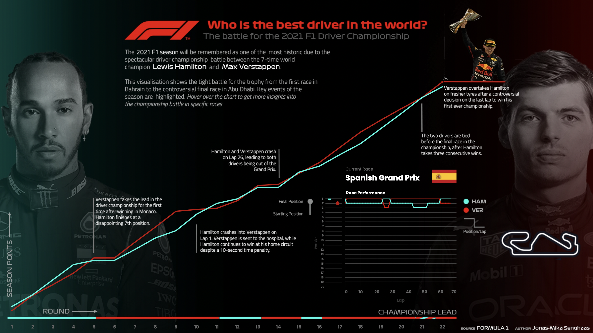

# 2021 Championship Battle: Verstappen vs. Hamilton

This repository contains all data, assets, preprocessing code and files in the toolchain that was used to create my exam project for the course *Data Visualisation and Data-Driven Decision Making* at the IT University of Copenhagen. 

The final product is hosted on [Tableau Public](https://public.tableau.com/app/profile/jonas.mika.senghaas/viz/Verstappenvs_Hamilton/DashboardLarge2). Further instructions on usage are both on the dashboard as well as the [report](report.pdf).

*Note, that it is recommended to open the dashboard on Tableau Public through a Google Chrome, since it supports the fonts of dashboard. Safari was found to not work.*